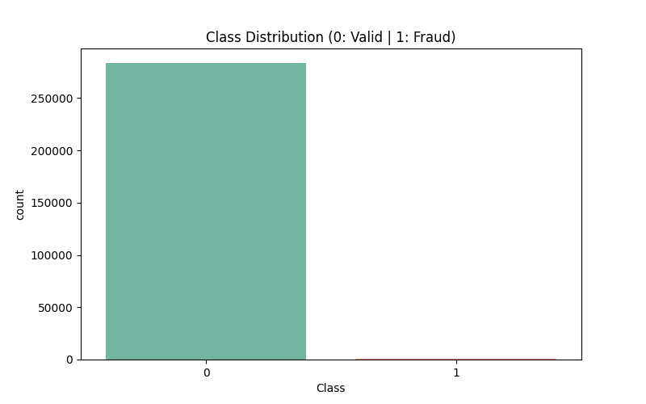

# Credit Card Fraud Detection: Automated EDA Pipeline

This repository contains an automated Exploratory Data Analysis (EDA) pipeline built in Python.

## Dataset Overview
* **Total Transactions:** 283,726
* **Fraudulent Transactions:** 473
* **Fraud Rate:** 0.167%

This is a highly imbalanced dataset, which requires specialized handling and visualization techniques.

## Key Visualizations

### 1. The Class Imbalance
As seen below, the target variable is massively skewed.

### 2. Transaction Time Density
Comparing when normal vs. fraudulent transactions occur.

### 3. Feature Separation (V14)
Principal Component V14 shows distinct separation between valid and fraudulent distributions, making it a strong predictor for machine learning models.

---
*Note: This README and all plots were generated entirely via a Python automation script.*
